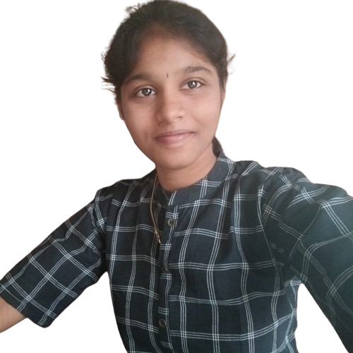

# Pavithra Eswaramoorthy - Front-end Developer

Welcome to my portfolio! Here you'll find a showcase of my projects and skills in front-end development and AI technologies.

---

## Table of Contents
1. [About Me](#about-me)
2. [Projects](#projects)
    - [Language Identification using ML](#language-identification-using-ml)
    - [Students Performance Analysis](#students-performance-analysis)
    - [Real-time Hand-Gesture Recognition](#real-time-hand-gesture-recognition)
    - [Image-to-Audio Conversion](#image-to-audio-conversion)
    - [Eat Enough](#eat-enough)
3. [Contact](#contact)

---

## About Me

I am a front-end developer passionate about AI technologies, aiming to drive advancements in the field while contributing to a progressive organization.

---

## Projects

### Language Identification using ML

**Description:** Utilizes machine learning to detect the language of a given text.

**Link:** [View Project](https://github.com/PavithraEswaramoorthy/Language-identification-using-ML)

### Students Performance Analysis

**Description:** Analyzes student performance using machine learning algorithms.

**Link:** [View Project](https://github.com/PavithraEswaramoorthy/Students-performance-analysis-using-ML)

### Real-time Hand-Gesture Recognition

**Description:** Recognizes hand gestures in real-time, useful for human-computer interaction and sign language recognition.

**Link:** [View Project](https://github.com/PavithraEswaramoorthy/Real-time-hand-gesture-recognition-using-DL)

### Image-to-Audio Conversion

**Description:** Converts images to audio using transformers.

**Link:** [View Project](https://github.com/PavithraEswaramoorthy/Image-to-audio)

### Eat Enough

**Description:** Calculates calorie intake and monitors health.

**Link:** [View Project](https://github.com/PavithraEswaramoorthy/eatenough)

---

## Contact

Ready for collaboration? Reach out via email or connect with me on [LinkedIn](https://www.linkedin.com/in/pavithra-eswaramoorthy) or [GitHub](https://github.com/PavithraEswaramoorthy/).

---

Thank you for visiting my portfolio!
